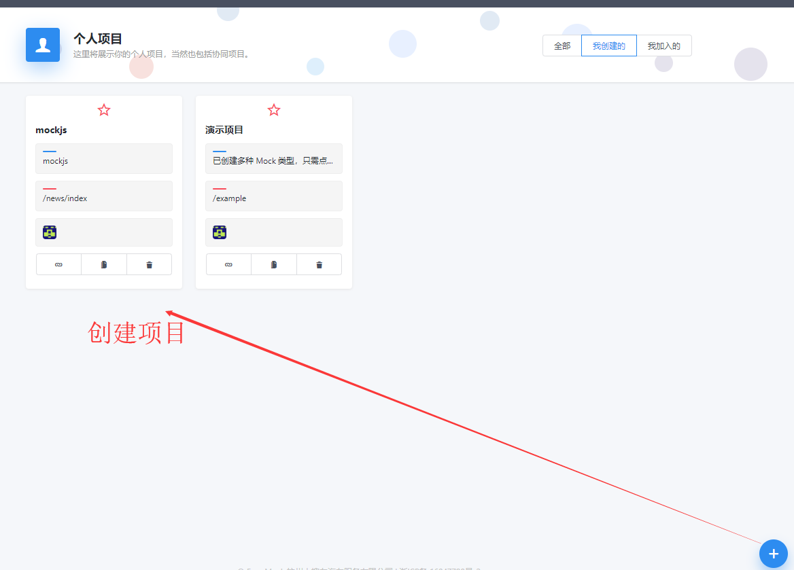
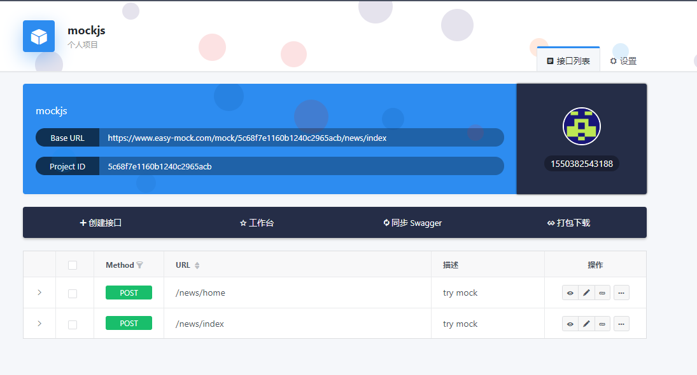
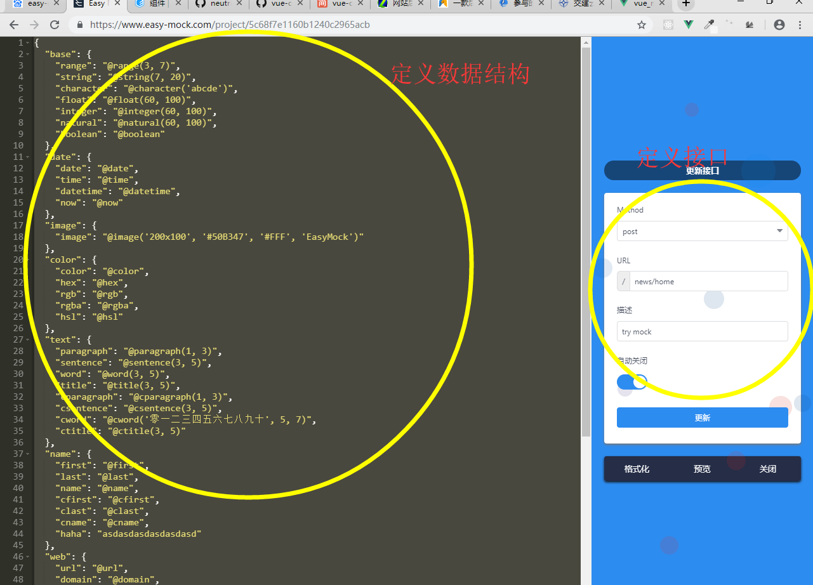

# vue_mockjs
## mockjs模拟数据和easy-mockjs使用对比
## mock模拟数据如下

安装安装mockjs，创建mock.js文件  代码如下，使用mock语法定义自己想要的数据，在main.js引入
main.js
```
import Vue from 'vue'
import App from './App.vue'
import router from './router'
import store from './store'
import './plugins/element.js'
import MockData from '../public/mock/mock.js'

Vue.config.productionTip = false
new Vue({
  router,
  store,
  MockData,
  render: h => h(App)
}).$mount('#app')
```

mock.js
```
const Mock = require('mockjs')
Mock.mock('/api/list', {
  'users|5-10': [{ // 随机生成5到10个数组元素
    'name': '@cname', // 中文名称
    'id|+1': 1, // 属性值自动加 1，初始值为1
    'age|18-28': 0, // 18至28以内随机整数, 0只是用来确定类型
    'birthday': '@date("yyyy-MM-dd")', // 日期
    'city': '@city(true)', // 中国城市
    'image': '@image(234x60,true)'
  }]
})

```
代码调用
```
getList: function () {
      api.JH_news('/api/list','type=1234')
      .then((res)=>{
        this.list = res.users;
      })
    },
```
## easy-mock模拟数据如下




## 总结
个人觉得easy-mock和本地json没什么区别，从图片可以看出，你可以写自己的数据结构，还是要大批量写数据，他是一个严格的json数据格式，
mockjs模拟的数据可以大量使用mockjs给的语法，代码简洁方便。

## 初始化项目
```
npm install
```

### 运行项目
```
npm run serve
```

### 项目打包
```
npm run build
```

